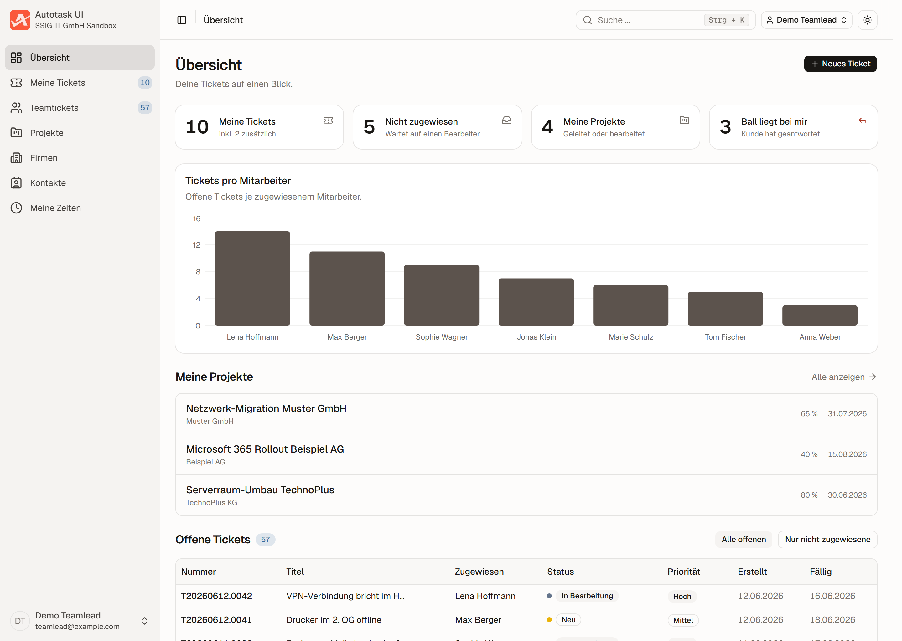
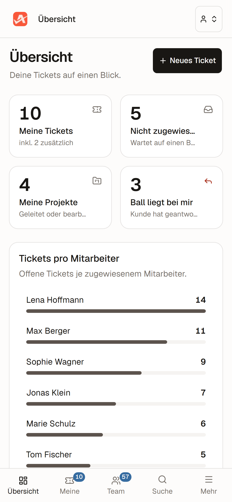
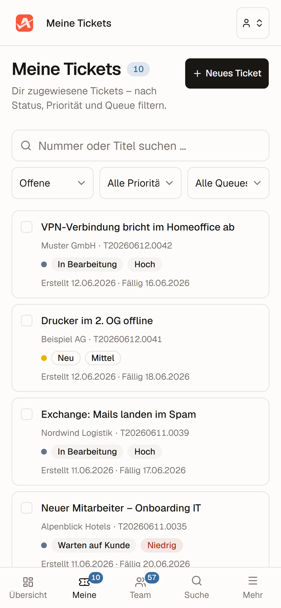

<div align="center">

# Autotask UI

**A focused, mobile-first interface for Kaseya Autotask PSA — installable as an app on your phone, strong on the desktop.**

Backend-for-Frontend: all Autotask credentials stay server-side. Internal tool, German UI.

[](https://github.com/paulkatio/pauls-autotask-ui/actions/workflows/ci.yml)
[](LICENSE)
[](https://nextjs.org)
[](https://react.dev)
[](https://tailwindcss.com)
[](#mobile--pwa)

**English** · [Deutsch](README.de.md)

</div>

---

<p align="center">
  
</p>

<p align="center">
  
  &nbsp;&nbsp;
  
</p>

<div align="center"><sub>Top: desktop. Bottom: the same tool on a phone — installable as a PWA. Demo data.</sub></div>

---

## Why

The classic Autotask interface is comprehensive but sluggish — especially on the go. This app surfaces only what technicians and the service desk actually need every day, and makes it fast: a clean dashboard, ticket lists with bulk actions, a focused ticket detail with a customer chat — on the desktop and on the phone. The browser talks exclusively to internal `/api` routes; the Autotask credentials never leave the server.

## Features

- **Dashboard** — "My tickets", KPI cards, team chart and work list at a glance.
- **Ticket lists** — mine / team / pool / "ball in my court", with filters, column sorting and bulk actions (including merge).
- **Ticket detail** — inline field editing, customer chat (TicketNotes), attachments and checklists.
- **Time tracking** — a lean stopwatch and "log time", day and week view with totals.
- **Projects, companies and contacts** — lists, detail pages, customer file with devices and contracts.
- **Global search** — spotlight (`⌘ / Ctrl + K`) across tickets, companies and contacts.
- **Light and dark** — automatic via semantic tokens, with a theme switch.

## Mobile & PWA

Built for the phone — not "desktop, just smaller":

- **Installable** as a PWA (`display: standalone`) — lands on the home screen with its own nice icon and launches without a browser bar.
- **Real mobile layouts** — cards instead of cramped tables, a bottom tab bar, safe-area handling for notch and home indicator, keyboard-aware heights (`dvh`) for the chat.
- **Touch targets from 44 px** below `sm`, tested from 320 px to ultrawide — no horizontal scrolling.
- **Desktop fully used** — fixed sidebar, pop-out windows, dense tables with reorderable columns.
- **Deliberately no service worker** — it is a live-data tool against the Autotask API; stale caches would be harmful.

## Tech stack

**Next.js 16** (App Router, Turbopack) · **React 19** · **TypeScript** · **Tailwind v4** · **shadcn/ui** (the only UI library) · charts via the shadcn `Chart` (Recharts) · `next-themes` · `@phosphor-icons/react` · **Auth.js v5** (Microsoft Entra ID) or mock · tests with **Playwright**.

## Getting started

**Prerequisites:** [Node.js](https://nodejs.org) 22.x and npm.

```bash
git clone https://github.com/paulkatio/pauls-autotask-ui.git
cd pauls-autotask-ui
npm install

cp .env.example .env.local        # then fill in the values (see the note below)
npm run dev                       # http://localhost:3000
```

On the login screen, click a demo user (mock auth) to enter.

> [!NOTE]
> The app renders **live data** from the Autotask REST API, so `.env.local` needs valid `AUTOTASK_*` credentials plus `AUTH_MODE=mock`. Without them the app starts, but the lists stay empty. The full list, quoting pitfalls and deployment details are in [`.env.example`](.env.example) and [`DEPLOY.md`](DEPLOY.md).

| Command | Purpose |
|---------|---------|
| `npm run dev` | Development server, mock login by click |
| `npm run build` | Production build (type-checked and compiled) |
| `npm run typecheck` · `npm run lint` | TS check · ESLint (gate in CI and pre-commit) |
| `npm run test:e2e` | Playwright smoke tests → [`e2e/README.md`](e2e/README.md) |

> [!TIP]
> Verify the connection (read-only, prints no secret):
> `node --env-file=.env.local scripts/verify-api.mjs ping`

## Configuration & deployment

All values come from the environment at **runtime** — never baked into the image, never committed. The full list, quoting pitfalls, Docker/Vercel and Entra redirect URIs are in [`.env.example`](.env.example) and **[`DEPLOY.md`](DEPLOY.md)**.

In short: `AUTOTASK_*` (backend) · `AUTH_MODE=mock|entra` (must be explicit in production, **fail-closed**) · `RESEND_*` / `AUTOTASK_INBOUND_MAILBOX` (customer mail) · optional `UPSTASH_REDIS_REST_*` (global thread limiter). Deployment-agnostic: **Vercel** or **Docker** (JWT session without a database, route protection server-side).

## Security

- **BFF** — Autotask credentials stay server-side; write paths are field-whitelisted per route; internal errors are never leaked raw to the browser.
- **Security headers** — `Strict-Transport-Security`, `X-Frame-Options`, `X-Content-Type-Options`, `Referrer-Policy`, `Permissions-Policy` and a CSP (report-only).

> [!WARNING]
> The backend is **production** (no sandbox protection). Please report vulnerabilities privately: [`SECURITY.md`](SECURITY.md).

## Documentation

Project docs are in German: [`docs/STATE.md`](docs/STATE.md) — status, architecture, features, env · [`docs/DECISIONS.md`](docs/DECISIONS.md) — verified API facts · [`DEPLOY.md`](DEPLOY.md) · [`CHANGELOG.md`](CHANGELOG.md) · project rules in [`CLAUDE.md`](CLAUDE.md).

## License

[MIT](LICENSE) © 2026 Paul-Harald Katio.
