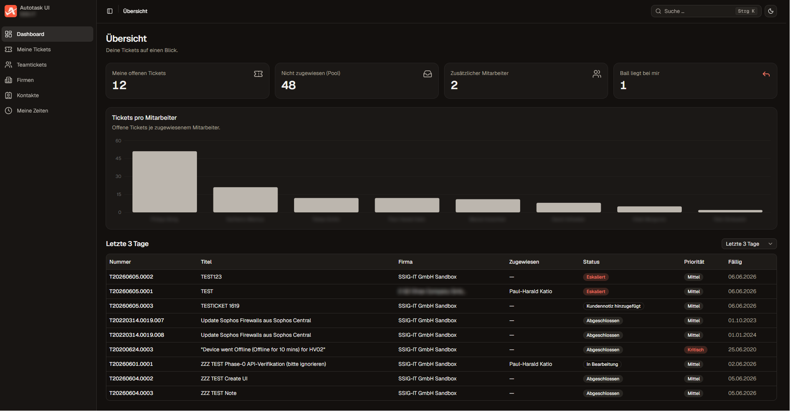
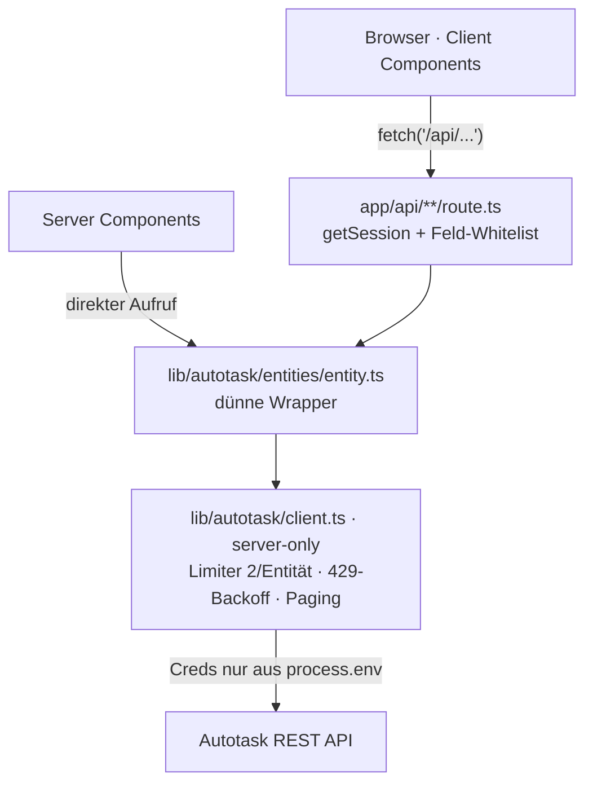

# Autotask UI

> A focused, modern web UI for Kaseya Autotask PSA — a Backend-for-Frontend that keeps
> all API credentials server-side. *(German-language internal tool.)*

[](LICENSE)
[](https://nextjs.org)
[](https://www.typescriptlang.org)
[](https://tailwindcss.com)
[](https://ui.shadcn.com)

Interne Web-App als fokussierte, modernere Alternative zur klassischen Autotask-
Oberfläche – nur was Techniker und Service-Desk täglich brauchen: Dashboard,
Ticketlisten mit Bulk-Aktionen, aufgeräumtes Ticketdetail mit Chat-Sidebar,
Zeiterfassung, Firmen-/Kontaktverwaltung und eine schnelle globale Suche.

Die App ist ein **Backend-for-Frontend (BFF)** vor der Autotask REST API: Der Browser
spricht ausschließlich mit internen `/api`-Routen dieser App; die Autotask-Zugangsdaten
bleiben **immer** serverseitig.



> 📖 **Einstieg für Mensch & KI:** [`docs/STATE.md`](docs/STATE.md) – Stand, Architektur,
> Features, Weichen, Cutover-Lücken, alles selbsterklärend.

---

## Inhalt

[Features](#features) · [Tech-Stack](#tech-stack) · [Architektur](#architektur) ·
[Schnellstart](#schnellstart) · [Konfiguration](#konfiguration) ·
[Deployment](#deployment) · [Sicherheit](#sicherheit) · [Tests](#tests) ·
[Projektstruktur](#projektstruktur) · [Doku](#dokumentation) · [Lizenz](#lizenz)

## Features

- **Dashboard** – KPI-Kacheln (offene/Pool/Ball-liegt-bei-mir) + „Tickets pro Mitarbeiter"-
  Diagramm + zuletzt bearbeitete Tickets.
- **Ticketlisten** (Meine / Team / Neben / Ball) – server-seitige Filter, Volltextsuche,
  **Bulk-Aktionen mit Undo** (Status/Priorität/Queue/Zuweisung über das bestehende
  PATCH, max. 3 parallel) und **per Drag & Drop umsortierbare Spalten** (persistent).
- **Ticketdetail** – Inline-Edit aller Kernfelder, **Chat-Sidebar** mit echter
  **Kundenmail via Resend** (Senden legt die TicketNote an + mailt; Antworten threaden
  über die Ticketnummer zurück), **Zeiterfassung + Stoppuhr**, interne Notizen, Anhänge.
- **Firmen + Kundenakte** und **Kontakte** mit Suche/Filter.
- **Globale Suche** – Spotlight-Palette (`Cmd/Ctrl+K`) mit 4 parallelen Spalten und eine
  `/search`-Seite mit „Mehr laden" je Spalte und Gesamtzahl.
- **Durchgängig responsiv**, Light/Dark über semantische Tokens, Ampel-Badges,
  layout-treue Lade-Skeletons.
- **Auth gekapselt:** lokaler Mock-Login **oder** Microsoft Entra ID – Umschalten kostet
  eine Env-Variable.

## Tech-Stack

Next.js 16 (App Router, Turbopack) · React 19 · TypeScript · Tailwind CSS v4 ·
**shadcn/ui** (und sonst keine UI-Library) · Charts über shadcn-`Chart` (Recharts) ·
`next-themes` (Light/Dark/System) · Icons `lucide-react` · Auth.js v5 (Entra ID) ·
Tests: Playwright.

## Architektur



Details: [`docs/STATE.md`](docs/STATE.md) (§3 Datenfluss) und
[`docs/ARCHITECTURE.md`](docs/ARCHITECTURE.md).

## Schnellstart

```bash
# 1. Abhängigkeiten
npm install

# 2. Zugangsdaten: Vorlage kopieren und füllen (siehe Konfiguration)
cp .env.example .env.local

# 3. Entwicklung (Mock-Login per Klick als Demo-User)
npm run dev            # http://localhost:3000
```

| Befehl | Zweck |
|--------|-------|
| `npm run dev` | Entwicklungsserver |
| `npm run build` | Produktions-Build (typisiert + kompiliert) |
| `npm run start` | Produktions-Server (nach Build) |
| `npm run lint` | ESLint |
| `npm run test:e2e` | Playwright-Smoke-Suite (einmalig: `npx playwright install chromium`) |

> **Verbindung prüfen:** `node --env-file=.env.local scripts/verify-api.mjs ping`
> testet die Autotask-Anbindung gegen deine Sandbox.

## Konfiguration

Alle Werte werden zur **Laufzeit** aus der Umgebung gelesen (nie ins Image gebacken,
nie committet). Vorlage: [`.env.example`](.env.example).

| Variable | Nötig | Zweck |
|---|---|---|
| `AUTH_MODE` | immer | `mock` (lokaler Login) oder `entra` (Microsoft Entra ID) |
| `AUTOTASK_BASE_URL` | immer | Zone-Endpoint, z. B. `https://webservicesX.autotask.net/ATServicesRest/V1.0` |
| `AUTOTASK_API_USERNAME` | immer | API-User |
| `AUTOTASK_API_SECRET` | immer | API-Secret (Sonderzeichen → in `.env.local` in **einfache** Quotes) |
| `AUTOTASK_INTEGRATION_CODE` | immer | Integration-Code |
| `AUTH_SECRET` | bei `entra` | `openssl rand -base64 32` (JWT-Signatur) |
| `ENTRA_CLIENT_ID` | bei `entra` | Application (client) ID |
| `ENTRA_CLIENT_SECRET` | bei `entra` | Client-Secret-Wert |
| `ENTRA_TENANT_ID` | bei `entra` | Directory (tenant) ID → tenant-spezifischer Issuer |
| `AUTH_URL` | bei `entra` | öffentliche https-Domain (Redirects/Callback) |
| `AUTH_TRUST_HOST` | bei `entra` (Non-Vercel) | `true` (hinter Reverse-Proxy) |
| `ENTRA_EMAIL_LOOSE_MATCH` | nur Sandbox | `1` = toleranter E-Mail→Resource-Abgleich (`+psasandbox`-Tag); in **Prod weglassen** |
| `RESEND_API_KEY` | für Chat-Mail | Resend-API-Key (Kundenmail beim Chat-Senden) |
| `RESEND_FROM` | für Chat-Mail | Absender auf verifizierter Resend-Domain, z. B. `SSIG-IT Service Desk <service@ssig-it.com>` |
| `AUTOTASK_INBOUND_MAILBOX` | für Chat-Mail | Autotask-Eingangspostfach = `Reply-To` (Antworten laufen als TicketNote zurück) |

> **Entra-Namen:** Der Provider wird in [`lib/auth/authjs.ts`](lib/auth/authjs.ts) **explizit**
> aus `ENTRA_CLIENT_ID/_SECRET/_TENANT_ID` konfiguriert — **nicht** aus den Auth.js-
> Defaults `AUTH_MICROSOFT_ENTRA_ID_*`. **Kundenmail:** Eine Chat-Nachricht legt die
> TicketNote an **und** sendet via Resend (`Reply-To` = Inbound-Mailbox); ohne
> Resend-Konfig bleibt der alte Autotask-Workflow-Pfad aktiv.

## Deployment

Deployment-agnostisch: **Vercel** *oder* **Docker/Self-Hosting**. JWT-Session (keine DB),
Route-Schutz server-seitig (kein `middleware.ts`), `output: "standalone"`. Ausführliche
Anleitung + Entra-Redirect-URIs: [`DEPLOY.md`](DEPLOY.md).

### Vercel

1. Repo importieren (Framework-Preset **Next.js**, Build/Output automatisch).
2. Env-Variablen (oben) im Projekt setzen (Production/Preview).
3. Im Entra-Modus die Redirect-URI ergänzen:
   `https://<projekt>.vercel.app/api/auth/callback/microsoft-entra-id`.

### Docker (Self-Hosting auf einem Linux-Server, z. B. hinter Caddy)

```bash
# Image bauen (enthält KEINE Secrets)
docker build -t autotask-ui .

# Starten – Env aus einer Datei injizieren (prod.env NICHT committen)
docker run -d --name autotask-ui \
  --env-file ./prod.env \
  -p 127.0.0.1:3000:3000 \
  --restart unless-stopped \
  autotask-ui
```

Den Container nur an `127.0.0.1:3000` binden; öffentlich erreichbar macht ihn ein
Reverse-Proxy mit TLS. Beispiel **Caddy** (automatisches Let's-Encrypt-Zertifikat):
[`Caddyfile.example`](Caddyfile.example).

```caddyfile
deine-domain.example.com {
    encode zstd gzip
    reverse_proxy 127.0.0.1:3000
}
```

Health-Check: `curl -I http://127.0.0.1:3000/login` → `HTTP 200`.

> Funktioniert auf jedem Docker-fähigen Host (eigener VPS, Hetzner, etc.). Im
> Entra-Modus zusätzlich `AUTH_URL=https://<domain>` und `AUTH_TRUST_HOST=true` setzen
> und die Redirect-URI in der Entra-App ergänzen.

## Sicherheit

- **Keine Secrets im Repo** (`.env*` gitignored; nur `.env.example` mit Platzhaltern).
- **BFF:** Autotask-/Auth-Creds bleiben server-seitig (`process.env`), nie im Client-Bundle
  oder in API-Antworten. Schreibpfade pro Route auf eine Feld-Whitelist begrenzt.
- **Container** ohne Secrets, läuft als non-root; Env erst zur Laufzeit.
- Sicherheitslücken melden: [`SECURITY.md`](SECURITY.md).

## Tests

Playwright-Smoke-Suite über die Kernpfade (Mock-Auth gegen die Sandbox). Details:
[`e2e/README.md`](e2e/README.md). Der einzige Schreibtest lässt sich per
`E2E_SKIP_WRITE_TESTS=1` abschalten.

## Projektstruktur

```
app/(app)/        geschützte App-Shell + Seiten (Dashboard, Tickets, Firmen, Kontakte, Suche, Zeiten)
app/api/          BFF-Routen (Whitelist + getSession)
components/       Feature-Slices + components/ui (vendored shadcn)
lib/auth/         Session + Provider (Mock | Entra, via AUTH_MODE)
lib/autotask/     generischer REST-Client + dünne Entity-Wrapper
hooks/            z. B. use-column-order (Spalten-Drag&Drop)
e2e/              Playwright-Smoke
docs/             STATE, DECISIONS, BACKLOG, BLUEPRINT, ARCHITECTURE, PHASE-0
```

## Dokumentation

- **[`docs/STATE.md`](docs/STATE.md)** — Stand, Architektur, Features, Weichen, Cutover (Start hier).
- [`docs/DECISIONS.md`](docs/DECISIONS.md) — verifizierte API-Fakten + Entscheidungs-Historie.
- [`docs/BACKLOG.md`](docs/BACKLOG.md) · [`docs/BLUEPRINT.md`](docs/BLUEPRINT.md) ·
  [`docs/ARCHITECTURE.md`](docs/ARCHITECTURE.md) · [`DEPLOY.md`](DEPLOY.md) ·
  [`CONTRIBUTING.md`](CONTRIBUTING.md).

> **Hinweis:** Beispiel-/Verifikationsdaten in den Docs (Firmen, Kontakte, Mock-User) sind
> **anonymisiert** (Platzhalter). Die Mock-User-Resource-IDs zeigen auf eine Autotask-
> Sandbox – beim Anschluss an einen anderen Mandanten anpassen.

## Lizenz

[MIT](LICENSE) © 2026 Paul-Harald Katio.
