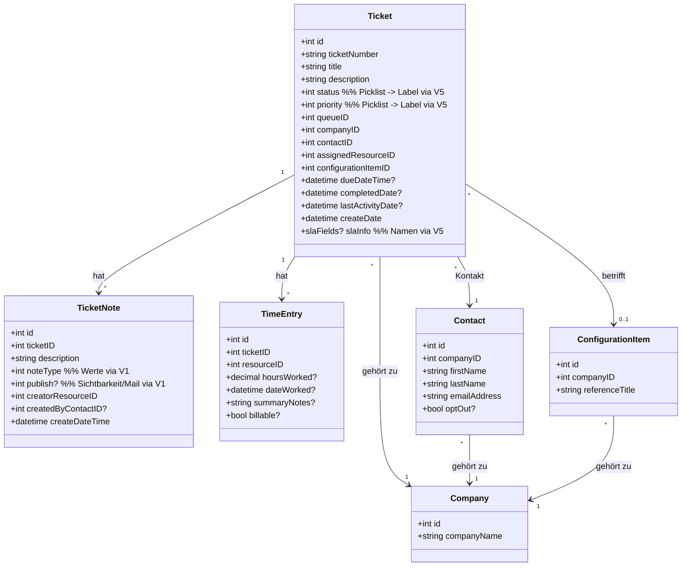

# BLUEPRINT – Interne Autotask-Ticket-App

Dieser Bauplan ist die fachliche Referenz. Die **Regeln** für deine Arbeit stehen
in `CLAUDE.md`, die **konkreten Aufgaben** in `docs/BACKLOG.md`, die **verifizierten
Fakten** in `docs/DECISIONS.md`. Bei Konflikt gilt: DECISIONS.md > CLAUDE.md >
dieser Blueprint.

---

## 1. Produktziel

Eine fokussierte, modernere Oberfläche für die tägliche Ticketarbeit – als
schlanke Alternative zur klassischen Autotask-UI. Optimiert auf "Meine Arbeit
heute": schnelle Übersicht, klare Listen, aufgeräumtes Ticketdetail, eine
chatartige Kommunikations-Sidebar.

**Nicht-Ziele:** kein Ersatz für ganz Autotask (kein Projektmanagement, Finance,
Procurement, tiefes Reporting). Kein eigenes generisches Chat-/Mail-System –
E-Mail bleibt in Autotask verankert. Keine weiteren UI-Libraries.

---

## 2. Nutzerrollen

- **Agent:** sieht Tickets, bei denen er Assigned/Primary Resource ist; darf
  Status/Priorität/Queue begrenzt ändern und TicketNotes anlegen.
- **Teamleiter:** sieht zusätzlich Tickets bestimmter Queues/Teams, kann
  Zuweisungen/Status fürs Team steuern.
- **Admin:** Vollzugriff in der App, inkl. Rollen-Mapping/Konfiguration.

Rolle kommt aus `SessionUser.roles`. Sichtbarkeit wird **serverseitig erzwungen**:
- "Meine Tickets" = `assignedResourceID == session.autotaskResourceId`.
- "Teamtickets" = bestimmte `queueID`/`departmentID`, nur Teamleiter/Admin.

---

## 3. Informationsarchitektur & Routen (Next.js App Router)

Hauptnavigation: Dashboard · Meine Tickets · Teamtickets · Suche · Admin

- `/` -> Dashboard
- `/tickets/my` -> Meine Tickets
- `/tickets/team` -> Teamtickets (nur Teamleiter/Admin)
- `/tickets/[id]` -> Ticketdetail (inkl. Chat-Sidebar)
- `/admin` -> Admin (Rollen-/Mapping-Übersicht)
- `/login` -> Login (Mock-Auswahl bzw. später Entra)

Primärer Flow: Login -> Dashboard -> KPI/Filter -> Liste -> Ticketdetail ->
Chat / Statusänderung.

---

## 4. Datenmodell (Domäne)

Die App spiegelt nur die Felder, die sie wirklich braucht. **Feldnamen mit `?`
sind Annahmen und in Phase 0 (V5) zu verifizieren**; nach Verifikation die echten
Namen in DECISIONS.md übernehmen.



---

## 5. Kommunikationsmodell / Chat-Sidebar

Ziel-UX: rechte Sidebar im Ticketdetail zeigt die Konversation zwischen Techniker
und Kontakt chronologisch, optisch wie ein Chat (Bubbles, Zeitstempel, Sender).
Technisch sind die "Nachrichten" **TicketNotes**.

- **Outbound:** Techniker tippt Text -> App legt eine TicketNote mit der in V1
  verifizierten `noteType`/`publish`-Kombination an -> Autotask versendet (per
  Workflow/Notification) eine E-Mail an den Kontakt.
- **Inbound:** Antworten kommen über Autotask Incoming-E-Mail als neue
  TicketNotes zurück. Die UI **pollt** die TicketNotes in Intervallen und
  aktualisiert den Verlauf.

**MVP = Variante A (Polling).** Variante B (TicketNote-Webhooks für Near-Realtime)
nur, wenn V4 Webhooks bestätigt – dann als spätere Erweiterung.

**Pflicht-Transparenz in der UI:** ein dezenter Hinweis "Nachrichten werden per
E-Mail zugestellt" (z. B. `Alert` oder Subtext), damit niemand Instant-Messaging
erwartet.

---

## 6. Funktionsumfang

### Must-have (MVP)
- Login (Mock; Entra-vorbereitet), SSO später.
- Dashboard "Meine Tickets": KPI-Kacheln + Arbeitsliste.
- Teamtickets mit leistungsfähiger Filterung.
- Ticketsuche (Nummer, Titel, Company, Kontakt).
- Ticketdetail mit Company, Contact, Device, SLA, Notes, TimeEntries.
- Anzeige TicketNotes + TimeEntries im Detail.
- Chat-Sidebar (TicketNotes-basiert, Outbound-Create).
- Performante Listen (serverseitiges Paging + Filter).

### Should-have
- SLA-Highlighting (gefährdete Tickets hervorheben).
- Inline-Aktionen in Listen (Status/Queue ändern, Note anlegen).
- TimeEntry-Create (nur falls V3 das erlaubt).

### Nice-to-have
- Webhook-basierte Near-Realtime-Updates (nur falls V4).
- Personalisierte Saved Views (App-eigene Persistenz).

---

## 7. Dashboard-Konzept

- **KPI-Kacheln** (shadcn `Card`): Offene Tickets · Überfällige · Heute fällig ·
  SLA-gefährdet.
- **Fokuslisten** (shadcn `Table`/DataTable): "Meine kritischen Tickets" (hohe
  Priorität / SLA-gefährdet), "Zuletzt bearbeitet" (nach lastActivityDate).
- **Teamkontext** (Teamleiter/Admin): ein shadcn-`Chart` (Bar/Donut) – Tickets
  pro Queue oder Resource.
- Datenaktualität: KPIs/Listen serverseitig über BFF laden, leichter Cache
  (30–60 s) zur API-Entlastung.

---

## 8. UX/UI-Konzept

- Konsistentes, minimalistisches SaaS-Design **ausschließlich aus shadcn/ui**.
  Keine frei gestalteten Komponenten – nur Komposition vorhandener Bausteine.
- **App-Shell:** shadcn `Sidebar` + Header (Theme-Umschalter, User-Menü).
- **Ticketdetail:** 3-Spalten-Layout (Meta / Aktivität / Chat) über
  `Resizable`/Grid + `Card`. Auf Mobile untereinander, Chat als eigener Tab.
- **Listen:** DataTable (Table + Pagination + Filter), Filterleiste aus `Select`,
  `Input`, `Badge`, `Popover`.
- **Zustände:** Laden = `Skeleton`; Fehler = `Alert` (inkl. Rate-Limit-Hinweis);
  leer = `Empty`.
- **A11y:** shadcn ist Radix-basiert; zusätzlich Kontrast/Fokus prüfen.
- **Dark Mode:** über semantische Tokens, Umschalter im Header (`next-themes`).

---

## 9. Technische Architektur

- **Framework/Hosting:** Next.js App Router, Ziel Vercel; lokal zuerst.
- **UI:** shadcn/ui + Tailwind v4; Charts via shadcn-`Chart`.
- **BFF:** Route-Handler unter `app/api/...` als einzige Brücke zur Autotask REST API.
- **Auth:** `lib/auth/`-Abstraktion (Mock -> Entra, siehe CLAUDE.md §4).
- **Autotask-Client:** `lib/autotask/client.ts`, server-only, mit Concurrency-
  Limiter (max 3/Tabelle), 429-Backoff, Picklist-Cache.
- **Caching (optional, später):** Upstash Redis / Vercel KV.

Prinzipien: Autotask-Creds nur im Backend; keine zusätzliche UI-Library; neue
UI-Komponenten nur als dünne Wrapper um shadcn.

---

## 10. API-Integrationsdesign (interne Routen)

| Interne Route                 | Autotask-Aufruf                                              | Methode |
|------------------------------|-------------------------------------------------------------|---------|
| `GET /api/tickets/my`        | `Tickets/query` (Filter: assignedResourceID = session)      | GET     |
| `GET /api/tickets/team`      | `Tickets/query` (Filter: queueID/departmentID)              | GET     |
| `GET /api/tickets/search`    | `Tickets/query` (Nummer/Titel/Company/Kontakt)              | GET     |
| `GET /api/tickets/[id]`      | Ticket + Company + Contact + CI + TicketNotes + TimeEntries  | GET     |
| `GET /api/tickets/[id]/chat` | `TicketNotes/query` (chronologisch)                         | GET     |
| `POST /api/tickets/[id]/chat`| `TicketNotes` Create (verifizierte noteType/publish)         | POST    |
| `PATCH /api/tickets/[id]`    | `Tickets` Patch (nur verifizierte Felder, z. B. status)     | PATCH   |
| `GET /api/picklists`         | `*/entityInformation/fields` + Picklists (gecacht)          | GET     |
| `POST /api/webhooks/autotask`| Webhook-Empfang (nur falls V4)                              | POST    |

Schreibrouten (`POST`/`PATCH`) bleiben deaktiviert, bis Phase 0 das jeweilige Feld
freigegeben hat.

---

## 11. Sicherheitskonzept

- Auth über `SessionUser`, später Entra ID (OIDC), Session serverseitig validiert.
- Secrets nur als Env-Variablen (lokal `.env.local`, später Vercel-Env). Nie im
  Client-Bundle, nie in Antworten an den Browser, nie in Logs.
- Autotask-API-User = dedizierter Account mit minimalen Rechten.
- 429-Handling mit Backoff und benutzerfreundlicher Meldung.
- Sichtbarkeitsregeln (meine/Team) immer serverseitig erzwingen, nie nur im UI.

---

## 12. Repo-Struktur (Zielbild)

```
.
├─ CLAUDE.md
├─ .env.example
├─ .env.local                # nicht committen
├─ README.md
├─ docs/
│  ├─ BLUEPRINT.md
│  ├─ PHASE-0-API-VERIFICATION.md
│  ├─ BACKLOG.md
│  └─ DECISIONS.md
├─ scripts/
│  └─ verify-api.ts          # Throwaway-Skript für Phase 0
├─ app/
│  ├─ layout.tsx
│  ├─ page.tsx               # Dashboard
│  ├─ login/page.tsx
│  ├─ tickets/
│  │  ├─ my/page.tsx
│  │  ├─ team/page.tsx
│  │  └─ [id]/page.tsx
│  ├─ admin/page.tsx
│  └─ api/
│     ├─ tickets/...
│     ├─ picklists/route.ts
│     └─ webhooks/autotask/route.ts
├─ components/
│  ├─ ui/                    # shadcn-Komponenten (vom CLI erzeugt)
│  ├─ shell/                 # Sidebar, Header, Theme-Toggle
│  ├─ dashboard/             # KPI-Cards, Charts
│  └─ tickets/               # Liste, Detail, Chat-Sidebar
└─ lib/
   ├─ auth/                  # session, provider, mock-provider, entra-provider, index
   ├─ autotask/              # client, types, mappers, throttle
   └─ utils.ts               # cn() etc.
```

---

## 13. Umsetzungsphasen (Überblick)

- **Phase 0 – API-Verifikation (B00).** Siehe eigenes Dokument. Blocker zuerst.
- **Phase 1 – Bootstrap.** Next.js + shadcn init, Tailwind v4, Theme-Toggle,
  App-Shell, Mock-Auth. Ergebnis: klickbare, leere App mit Navigation + Dark Mode.
- **Phase 2 – Autotask-Client + Picklists.** Server-Client mit Throttle/Backoff,
  Picklist-Endpoint, getypte Mapper.
- **Phase 3 – Meine Tickets.** Liste + Filter + Paging gegen echte Sandbox.
- **Phase 4 – Ticketdetail.** Meta/Aktivität-Layout, Notes + TimeEntries (read).
- **Phase 5 – Chat-Sidebar.** TicketNotes lesen (Polling) + Outbound-Create gemäß V1.
- **Phase 6 – Teamtickets + Dashboard-KPIs + Chart.**
- **Phase 7 – Should-haves nach Verifikation** (Statusänderung inline,
  TimeEntry-Create falls V3, SLA-Highlighting). Danach optional Entra ID + Deploy.

Detaillierte, abarbeitbare Aufgaben: `docs/BACKLOG.md`.

---

## 14. Akzeptanzkriterien (Gesamt)

- UI vollständig aus shadcn/ui, kein Custom-CSS außer Tailwind-Utilities, Light +
  Dark Mode funktionieren.
- Alle Kern-Flows (Login, Meine Tickets, Teamtickets, Detail, Chat) laufen stabil
  gegen die Autotask-Sandbox.
- Schreibpfade nur dort aktiv, wo Phase 0 sie freigegeben hat.
- Auth über `AUTH_MODE` von Mock auf Entra umschaltbar, ohne Geschäftslogik
  anzufassen.
